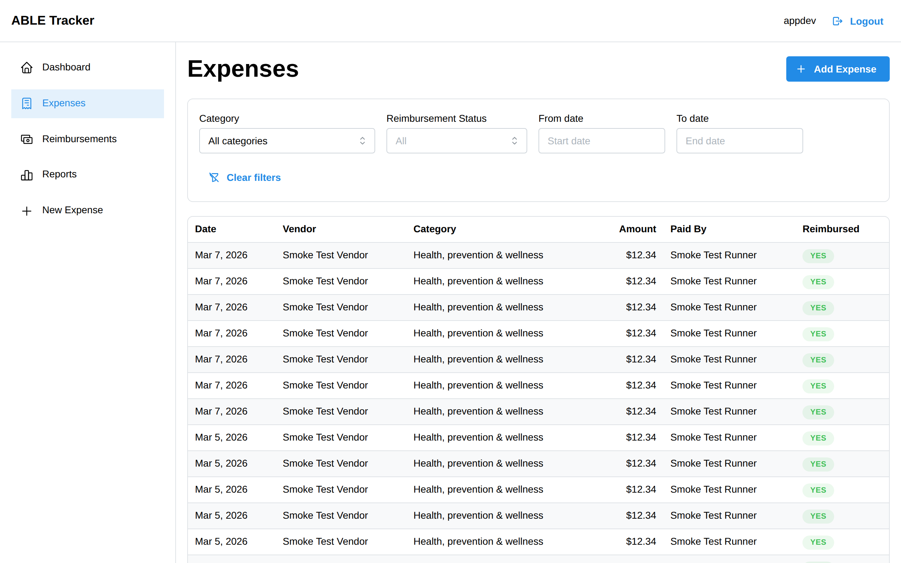
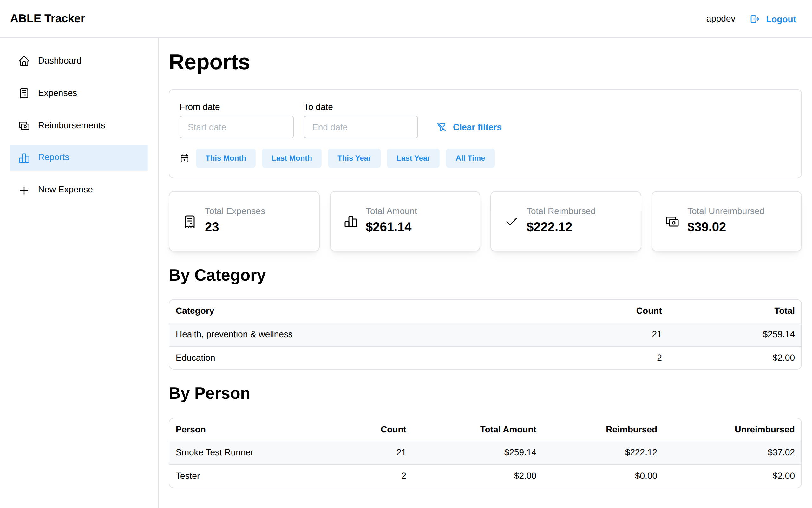

# ABLE Tracker -- Product Demo

> Last updated: Sprint 6, 2026-03-07 (post-deployment)

## What is ABLE Tracker?

ABLE Tracker is an open-source Progressive Web App (PWA) for managing qualified ABLE (Achieving a Better Life Experience) account expenses. Authorized representatives log out-of-pocket expenses, upload receipts, and use AI-powered categorization to map expenses to the 11 IRS-qualified ABLE categories -- making tax documentation and reimbursement tracking straightforward.

## Who is this for?

- **Primary Representatives** -- Family members who manage an ABLE account day-to-day, entering most expenses and tracking reimbursements
- **Secondary Representatives** -- Occasional users who log expenses on behalf of the beneficiary
- **Open Source Adopters** -- Families discovering the app for their own ABLE account needs

## Live Environment

| Component | URL |
|-----------|-----|
| Frontend  | `<your-cloudfront-url>` (see `deployment.env.example`) |
| API       | `<your-api-url>` (see `deployment.env.example`) |
| Auth      | AWS Cognito (username/password) |

---

## Demo Walkthrough

### 1. Login


The login page is the first screen every user sees. It is a clean, centered card with the "ABLE Tracker" title and two form fields.

**Steps:**

1. Navigate to the application URL. If you are not logged in, you will be redirected to the login page automatically.
2. Enter your **email address** in the "Email" field.
3. Enter your **password** in the "Password" field.
4. Click **"Sign in"**.

**What happens:**
- The app authenticates against AWS Cognito using your email and password.
- On success, you are redirected to the Dashboard.
- On failure, a red notification banner appears with the error message (e.g., "Incorrect username or password").

**Verification:**
- [ ] Login page displays "ABLE Tracker" title and email/password fields
- [ ] Empty fields show validation errors ("Email is required", "Password is required")
- [ ] Invalid credentials show a red error notification
- [ ] Successful login redirects to the Dashboard

---

### 2. Auth Guard (Protected Routes)


All application pages (Dashboard, Expenses, Add Expense) are protected. Unauthenticated users cannot access any data.

**Steps:**

1. Open a new browser tab (or clear your session).
2. Navigate directly to any protected URL (e.g., `/expenses` or `/expenses/new`).
3. Observe that you are automatically redirected to `/login`.

**What happens:**
- The `AppLayout` component checks authentication state on every page load.
- If the user's JWT is missing or expired, the app redirects to the login page.
- No expense data is visible without authentication.

**Verification:**
- [ ] Navigating to `/` without a session redirects to `/login`
- [ ] Navigating to `/expenses` without a session redirects to `/login`
- [ ] Navigating to `/expenses/new` without a session redirects to `/login`
- [ ] After logging in, the user is redirected to the Dashboard

---

### 3. Dashboard


The Dashboard is the landing page after login. It greets the user by name, provides quick-action cards for common tasks, shows a reimbursement summary, and lists recent expenses.

**Steps:**

1. After logging in, you arrive at the Dashboard.
2. Observe the welcome message: **"Welcome, [Your Display Name]"**.
3. See two quick-action cards:
   - **"Add Expense"** -- Record a new qualified ABLE expense
   - **"View Expenses"** -- Browse and manage your expenses
4. Below the quick actions, the **Reimbursements** section shows:
   - **Total Unreimbursed** -- The aggregate amount owed across all payers
   - Per-person cards showing each payer's name, amount owed, and expense count
5. The **Recent Expenses** section shows the 5 most recent expenses with vendor, date, and amount.

**What happens:**
- The display name is extracted from your Cognito JWT token claims.
- Each quick-action card is a clickable link that navigates to the corresponding page.
- Reimbursement summaries are fetched from the `/dashboard/reimbursements` API endpoint.
- Recent expenses are fetched from `/expenses` and trimmed to the 5 most recent.
- If no expenses exist, an empty state is shown with a link to add the first expense.

**Verification:**
- [ ] Dashboard displays "Welcome, [name]" with the logged-in user's display name
- [ ] "Add Expense" card links to `/expenses/new`
- [ ] "View Expenses" card links to `/expenses`
- [ ] Cards are visually distinct with icons (blue plus icon, teal receipt icon)
- [ ] Reimbursements section shows total unreimbursed amount
- [ ] Per-person reimbursement cards show name, amount, and expense count
- [ ] Recent Expenses section shows up to 5 expenses with vendor, date, and amount
- [ ] Empty state shows a friendly message with a link to add an expense

---

### 4. Navigation


The app uses a sidebar navigation layout with a fixed header. On mobile, the sidebar collapses behind a hamburger menu.

**Header (always visible):**
- **Skip to content** link (visible on keyboard focus) -- jumps directly to the main content area
- "ABLE Tracker" title on the left
- User's display name and a **Logout** button on the right

**Sidebar links:**
- **Dashboard** (home icon) -- `/`
- **Expenses** (receipt icon) -- `/expenses`
- **Reimbursements** (cash icon) -- `/reimbursements`
- **Reports** (chart icon) -- `/reports`
- **New Expense** (plus icon) -- `/expenses/new`

**Steps:**

1. From any page, observe the sidebar on the left with five navigation links.
2. Click each link to navigate between pages.
3. On the header, observe your display name and the Logout button.
4. Click **Logout** to end your session and return to the login page.

**Mobile behavior:**


1. Resize your browser window to a narrow width (below the `sm` breakpoint).
2. The sidebar collapses and a hamburger icon appears in the header.
3. Tap the hamburger to open/close the sidebar as an overlay.

**Verification:**
- [ ] Five navigation links are visible: Dashboard, Expenses, Reimbursements, Reports, New Expense
- [ ] Active page is visually highlighted in the sidebar
- [ ] Clicking a link navigates to the correct page
- [ ] Display name appears in the header
- [ ] Logout button ends the session and redirects to login
- [ ] On mobile, sidebar collapses behind a hamburger menu
- [ ] Navigation is fully keyboard accessible (Tab, Enter)
- [ ] Skip-to-content link is visible on keyboard focus and jumps to `#main-content`

---

### 5. Add Expense Form


This is the core data entry form where authorized representatives record qualified ABLE expenses.

**Form fields:**

| Field       | Type          | Required | Notes |
|-------------|---------------|----------|-------|
| Vendor      | Text input    | Yes      | e.g., "University Bookstore" (max 200 characters) |
| Description | Text area     | Yes      | Describe what the expense was for (max 1,000 characters) |
| Amount      | Number input  | Yes      | Entered in dollars (e.g., $75.00), converted to cents internally. Max $1,000,000 |
| Date        | Date picker   | Yes      | Defaults to today; cannot be a future date |
| Paid By     | Text input    | Yes      | Who paid out-of-pocket for this expense (max 100 characters) |
| Category    | Select/AI     | No       | One of 11 ABLE categories; can be selected manually or suggested by AI |
| Receipt     | File upload   | No       | Accepts images and PDFs (upload UI present, backend handler exists) |

**Steps:**

1. Navigate to **New Expense** (via sidebar or Dashboard quick action).
2. Fill in the **Vendor** field (e.g., "CVS Pharmacy").
3. Add a **Description** (e.g., "Monthly prescription medications for beneficiary").
4. Enter the **Amount** in dollars (e.g., `45.50`). The `$` prefix is shown automatically. The value is stored as 4550 cents internally.
5. Select or confirm the **Date** (defaults to today).
6. Enter **Paid By** (e.g., "Jane Smith").
7. For **Category**, you have two options:
   - Select manually from the dropdown (see Section 6 below for AI categorization)
   - Click **"Suggest Category"** to let AI choose (see Section 6)
8. Optionally attach a **Receipt** file.
9. Click **"Create Expense"**.

**What happens on submit:**
- The form validates all required fields. Missing fields show inline error messages.
- The amount is converted from dollars to integer cents (e.g., $45.50 becomes 4550).
- A POST request is sent to the API with the expense data.
- On success, a green notification appears: "Your expense has been recorded successfully."
- The user is redirected to the Expense List page.

**Validation rules:**
- Vendor, Description, and Paid By must not be empty
- Vendor max 200 characters, Description max 1,000 characters, Paid By max 100 characters
- Amount must be greater than zero and no more than $1,000,000
- Date must not be in the future

**Verification:**
- [ ] All required fields show error messages when submitted empty
- [ ] Amount field displays `$` prefix and formats to two decimal places
- [ ] Amount rejects values over $1,000,000
- [ ] Character limits enforced: Vendor (200), Description (1,000), Paid By (100)
- [ ] Date picker defaults to today and blocks future dates
- [ ] Category dropdown lists all 11 ABLE categories
- [ ] Success notification appears after creating an expense
- [ ] User is redirected to the expense list after successful creation
- [ ] File input accepts images and PDFs

---

### 6. AI Categorization (Suggest Category)


ABLE Tracker integrates with the Claude AI API to automatically suggest which of the 11 IRS-qualified ABLE categories an expense belongs to. This saves time and reduces errors for users who are not familiar with the category definitions.

**The 11 ABLE categories:**

1. Education
2. Housing
3. Transportation
4. Employment training & support
5. Assistive technology & personal support
6. Health, prevention & wellness
7. Financial management & administrative
8. Legal fees
9. Oversight & monitoring
10. Funeral & burial
11. Basic living expenses

**Steps:**

1. On the Add Expense form, enter a **Vendor** and/or **Description**.
   - Example: Vendor = "CVS Pharmacy", Description = "Monthly prescription medications"
2. Click the **"Suggest Category"** button (sparkle icon).
3. The button shows a loading spinner while the AI processes the request.
4. The AI analyzes the vendor and description and selects the most appropriate category.
5. The **Category** dropdown is automatically populated with the suggestion (e.g., "Health, prevention & wellness").
6. You can **accept** the suggestion or **override** it by selecting a different category from the dropdown.

**What happens behind the scenes:**
- The frontend sends only the vendor and description to POST `/categorize` (no PII is ever sent to the AI).
- The Claude API evaluates the text against the 11 ABLE category definitions.
- The response includes a suggested category, confidence level (high/medium/low), and reasoning.
- If the AI cannot determine a category, a yellow notification appears: "AI could not determine a category. Please select one manually."

**Edge cases:**
- If both Vendor and Description are empty, clicking "Suggest Category" shows a yellow warning: "Please enter a vendor and/or description before requesting a category suggestion."
- If the API call fails, a red notification appears with the error details.

**Verification:**
- [ ] "Suggest Category" button has a sparkle icon and loading state
- [ ] AI populates the Category dropdown with a suggestion
- [ ] User can accept or override the AI suggestion
- [ ] Empty vendor/description shows a warning notification
- [ ] API errors show a red notification
- [ ] No personally identifiable information is sent to the AI

---

### 7. Expense List


The Expense List page shows all recorded expenses in a table format. It includes filtering capabilities and a prominent "Add Expense" button.

**Table columns:**

| Column     | Description |
|------------|-------------|
| Date       | Formatted as "MMM D, YYYY" (e.g., "Feb 15, 2026") |
| Vendor     | The business or entity that was paid |
| Category   | The ABLE category assigned to the expense |
| Amount     | Formatted as currency (e.g., "$75.00") |
| Paid By    | Who paid out-of-pocket |
| Reimbursed | Badge showing "Yes" (green) or "No" (gray) |

**Filters:**



The filter bar at the top of the table provides four filter controls:

1. **Category** -- Dropdown to filter by any of the 11 ABLE categories (or "All categories")
2. **Reimbursement Status** -- Dropdown to filter by "Unreimbursed", "Reimbursed", or "All" (default)
3. **From date** -- Date picker for the start of a date range
4. **To date** -- Date picker for the end of a date range
5. **Clear filters** -- Button to reset all filters

The Reimbursement Status filter sends the `reimbursed` query parameter to the backend API, so filtering happens server-side for accurate results.

**Steps:**

1. Navigate to **Expenses** from the sidebar.
2. If expenses exist, they appear in a striped, hover-highlighted table.
3. Use the **Category** dropdown to filter by a specific ABLE category.
4. Use the **Reimbursement Status** dropdown to show only unreimbursed or reimbursed expenses.
5. Use the **From date** and **To date** pickers to filter by date range.
6. Click **"Clear filters"** to reset all filters.
7. Click **"Add Expense"** (top right) to create a new expense.

**Empty state:**


If no expenses have been recorded yet, the page shows a friendly empty state with a receipt icon and the message: "No expenses yet. Add your first expense to get started." with a link to the Add Expense form.

**Verification:**
- [ ] Table displays all expenses with correct formatting
- [ ] Amount is formatted as currency (e.g., "$75.00")
- [ ] Date is formatted as "MMM D, YYYY"
- [ ] Reimbursed column shows colored badges (green for Yes, gray for No)
- [ ] Category filter dropdown includes all 11 ABLE categories
- [ ] Reimbursement Status filter shows "Unreimbursed", "Reimbursed", or "All"
- [ ] Reimbursement Status filter queries the backend (server-side filtering)
- [ ] Date range filter restricts displayed expenses
- [ ] "Clear filters" resets all filter controls including Reimbursement Status
- [ ] Empty state shows a helpful message with a link to add an expense
- [ ] "Add Expense" button in the header links to the form
- [ ] Table rows are clickable (cursor changes to pointer)

---

### 8. Reimbursements


The Reimbursements page provides a dedicated view of who is owed money and how much. It aggregates all unreimbursed expenses by payer and lets users mark expenses as reimbursed directly from the table.

**Page sections:**

1. **Total Unreimbursed** -- A prominent banner showing the aggregate unreimbursed amount across all payers
2. **Per-person cards** -- Each card shows the payer's name, number of unreimbursed expenses, and total amount owed (displayed in red)
3. **Unreimbursed Expenses table** -- All unreimbursed expenses with date, vendor, paid by, amount, and a "Mark Reimbursed" action button
4. **Add Expense button** -- Quick action to create a new expense from this page

**Steps:**

1. Navigate to **Reimbursements** from the sidebar.
2. Observe the **Total Unreimbursed** amount at the top.
3. Review the per-person breakdown cards showing who is owed what.
4. Scroll down to see the **Unreimbursed Expenses** table.
5. Click **"Mark Reimbursed"** on any expense to mark it as reimbursed.
6. A confirmation dialog appears: "Mark [vendor] expense of [amount] paid by [name] as reimbursed?"
7. On confirmation, the expense is marked via `PUT /expenses/{id}/reimburse` and the page refreshes.

**What happens:**
- All expenses are fetched from the API via `/expenses`.
- The page filters out reimbursed expenses and aggregates the remaining by `paidBy` field.
- Per-person cards are sorted by total owed (highest first).
- The Unreimbursed Expenses table shows only expenses where `reimbursed` is false (no truncation — all records shown).
- The "Mark Reimbursed" button shows a loading spinner while the API call is in progress, and other buttons are disabled to prevent concurrent actions.

**Empty states:**
- If no expenses exist, a friendly message appears: "No expenses yet. Add your first expense to start tracking reimbursements."
- If all expenses are reimbursed, a green "All caught up!" message appears.

**Verification:**
- [ ] Total Unreimbursed amount is displayed prominently
- [ ] Per-person cards show payer name, expense count, and amount owed in red
- [ ] Amount owed excludes reimbursed expenses
- [ ] Unreimbursed Expenses table shows only unreimbursed expenses (no reimbursed rows)
- [ ] Table shows all unreimbursed expenses without truncation
- [ ] "Mark Reimbursed" button appears on each row with a green checkmark icon
- [ ] Clicking "Mark Reimbursed" shows a confirmation dialog before proceeding
- [ ] After confirming, the expense disappears from the table and totals update
- [ ] Button shows loading state during API call; other buttons are disabled
- [ ] Error alert appears if the reimbursement API call fails
- [ ] "Add Expense" button links to `/expenses/new`
- [ ] Empty state shows when no expenses exist
- [ ] "All caught up!" state shows when all expenses are reimbursed

---

### 9. Reports



The Reports page provides a high-level financial overview of all expenses with summary statistics, category breakdown, and per-person spending analysis. It supports date range filtering with quick presets to analyze expenses over specific periods.

**Page sections:**

1. **Date range filter** -- From/To date pickers with a "Clear filters" button and quick preset buttons
2. **Quick date presets** -- One-click buttons for common ranges: "This Month", "Last Month", "This Year", "Last Year", "All Time"
3. **Summary cards** -- Four cards showing key metrics:
   - **Total Expenses** -- Count of all expenses in the filtered range
   - **Total Amount** -- Sum of all expense amounts
   - **Total Reimbursed** -- Sum of amounts that have been reimbursed
   - **Total Unreimbursed** -- Sum of amounts still awaiting reimbursement
4. **By Category table** -- Breakdown of expenses by ABLE category, sorted by total amount (highest first), showing category name, count, and total
5. **By Person table** -- Breakdown of expenses by payer, sorted by total amount (highest first), showing person name, count, total amount, reimbursed amount, and unreimbursed amount

**Steps:**

1. Navigate to **Reports** from the sidebar.
2. View the four summary cards for an instant financial overview.
3. Scroll down to the **By Category** table to see spending distribution across ABLE categories.
4. Continue to the **By Person** table to see spending and reimbursement status per payer.
5. Use the **quick preset buttons** (This Month, Last Month, This Year, Last Year, All Time) for common date ranges.
6. Or use the **From date** and **To date** pickers to set a custom date range.
7. Click **"Clear filters"** to reset and view all expenses.

**What happens:**
- All expenses are fetched from the API via `/expenses` (with optional date filters).
- Summary statistics are aggregated client-side from the full expense list.
- The category breakdown groups expenses by their ABLE category and sorts by total amount descending.
- The person breakdown groups expenses by `paidBy` field, showing total, reimbursed, and unreimbursed amounts for each payer.
- Clicking a date preset automatically sets the From/To dates and triggers a refresh.
- Changing date filters triggers a new API call and recalculates all summaries.

**Empty state:**
- If no expenses exist (or none match the date filter), a friendly message appears: "No expenses yet. Add your first expense to start viewing reports."

**Verification:**
- [ ] Reports page displays four summary cards with correct totals
- [ ] Total Amount = Total Reimbursed + Total Unreimbursed
- [ ] By Category table shows all categories with expenses, sorted by total descending
- [ ] Category count and total are accurate
- [ ] By Person table shows all payers with count, total, reimbursed, and unreimbursed columns
- [ ] Per-person reimbursed + unreimbursed = total for each row
- [ ] Date range quick presets (This Month, Last Month, This Year, Last Year, All Time) set correct dates
- [ ] Custom date range filter narrows results and updates all summaries
- [ ] "Clear filters" resets date range and shows all expenses
- [ ] Empty state shows when no expenses exist or match filters
- [ ] All amounts are formatted as currency (e.g., "$187.10")

---

### 10. Logout


**Steps:**

1. From any page, click the **Logout** button in the top-right corner of the header.
2. The session is cleared (tokens removed from sessionStorage).
3. You are redirected to the login page.

**Verification:**
- [ ] Logout button is always visible in the header
- [ ] Clicking Logout clears the session
- [ ] After logout, navigating to any protected route redirects to login
- [ ] Refreshing the page after logout does not restore the session

---

## Infrastructure Overview

ABLE Tracker runs on a fully automated AWS infrastructure, defined entirely in CDK (Infrastructure as Code). No manual console changes.

| Layer | Service | Purpose |
|-------|---------|---------|
| Auth | AWS Cognito | User authentication with email/password, JWT tokens |
| Frontend | S3 + CloudFront | Static PWA hosting with HTTPS and global CDN |
| API | API Gateway (HTTP API) | RESTful endpoints with JWT authorizer |
| Compute | AWS Lambda (TypeScript) | Serverless request handlers |
| Database | DynamoDB (single-table) | Expense storage with GSI for category and paidBy queries |
| Storage | S3 (private) | Receipt file storage via presigned upload URLs |
| AI | Claude API (Sonnet) | Expense categorization into 11 ABLE categories |
| Logging | CloudWatch Logs | Structured JSON Lambda logging with request tracing |
| Monitoring | CloudWatch Alarms | 5xx error rate and AI categorization latency (p99) alerts |
| E2E Testing | Playwright | End-to-end browser tests for critical paths |
| CI/CD | GitHub Actions | Automated tests, security review, and deployment pipelines |

### API Endpoints

| Method | Path | Purpose |
|--------|------|---------|
| POST   | `/expenses` | Create a new expense |
| GET    | `/expenses` | List expenses (with optional category/date/reimbursed filters) |
| GET    | `/expenses/{id}` | Get a single expense by ID |
| POST   | `/expenses/categorize` | AI categorization of an expense |
| PUT    | `/expenses/{id}/reimburse` | Mark an expense as reimbursed |
| GET    | `/dashboard/reimbursements` | Reimbursement summary dashboard |
| POST   | `/uploads/request-url` | Get a presigned S3 URL for receipt upload |

All API endpoints require a valid Cognito JWT in the `Authorization: Bearer <token>` header. Requests without valid authentication receive a 401 response at the API Gateway level (defense-in-depth: Lambda handlers also validate auth context).

### Security Measures

- **API Gateway JWT authorizer** -- All routes require Cognito JWT validation before reaching Lambda
- **Lambda-level auth validation** -- Defense-in-depth; handlers verify auth context independently
- **Least-privilege IAM** -- Lambda roles use fine-grained DynamoDB permissions (specific actions on specific table/index ARNs) instead of broad wildcards; S3 access scoped to `receipts/*` prefix
- **CORS restriction** -- API only accepts requests from the deployed frontend domain and localhost
- **Input validation** -- String length limits (vendor 200, description 1000, paidBy 100, categoryNotes 500), amount validation (>0, max $1M), receipt key scoping; AI categorization endpoint enforces separate input length limits
- **Generic error messages** -- Auth failures return generic messages; no implementation details leaked
- **Secret scanning** -- Pre-commit hook and CI pipeline scan for leaked secrets/credentials
- **No PII to AI** -- Only vendor name and description are sent to the Claude API; no account numbers, SSNs, or personal data
- **API throttling** -- API Gateway enforces rate limits: 100 requests/sec (200 burst) globally, with tighter limits on the AI categorization endpoint (10 requests/sec, 20 burst)
- **Upload size limits** -- Presigned upload URLs enforce a 10 MB maximum file size, validated both at the handler level and embedded in the presigned URL signature
- **Structured logging** -- All Lambda handlers emit structured JSON logs with request IDs, handler names, timestamps, and metadata for traceability
- **CloudWatch monitoring** -- Alarms on 5xx error rate (>5 errors in 5 minutes) and AI categorization latency (p99 >10 seconds)
- **Post-deploy smoke tests** -- Automated CI pipeline validates all API endpoints after every deployment
- **Accessibility (WCAG 2.1 AA)** -- Skip-to-content link, proper heading hierarchy, ARIA labels and live regions, keyboard navigation; full audit in `docs/ACCESSIBILITY.md`
- **Security audit** -- Comprehensive security review documented in `docs/SECURITY.md`

---

## Coming Soon

The following features are planned but not yet implemented:

### Receipt Upload UI
- **What**: Frontend interface for attaching receipt photos/PDFs to expenses
- **Why**: Receipts are essential for tax documentation of ABLE expenses
- **Status**: Backend presigned URL handler exists; file input is on the form; upload wiring not yet complete

### Bulk Reimbursement Workflow (Issue #109)
- **What**: Select multiple unreimbursed expenses and reimburse them together with a running total
- **Why**: In practice, one check covers multiple expenses — the per-expense button doesn't match the real workflow
- **Status**: Issue created; exploring checkbox multi-select, per-person bulk action, or hybrid approach

### Export to CSV/PDF (Issue #24)
- **What**: Export filtered expenses for tax preparation
- **Status**: Not started

### Dark Mode (Issue #26)
- **What**: Dark color scheme toggle, respecting system preferences
- **Status**: Not started

### OCR Receipt Scanning (Issue #23)
- **What**: Auto-extract vendor, amount, and date from receipt photos
- **Status**: Not started

---

## Known Limitations

### ~~API Deployment Gap (Issue #73, fixed in PR #76)~~ -- RESOLVED

**Status: Fixed and deployed.** Lambda functions now use real TypeScript handlers bundled with esbuild via CDK `NodejsFunction`. All 7 API endpoints process real data. The CORS configuration includes the CloudFront domain so the frontend can communicate with the API.

### No Self-Registration

New users cannot sign up on their own. User accounts must be created by an administrator in the Cognito console. This is by design for security (prevents unauthorized access to ABLE account data), but a managed invitation flow is planned.

### No Expense Editing or Deletion

Once an expense is created, it cannot be edited or deleted through the UI. This will be addressed in a future sprint.

### No Expense Detail View

Clicking a table row in the expense list logs the expense ID to the console but does not navigate to a detail page. A dedicated expense detail view is planned.

### Mobile Optimization

The app is responsive (sidebar collapses on narrow screens), but has not been optimized specifically for mobile touch targets, swipe gestures, or native-app-like interactions.

### Dashboard Reimbursements Endpoint

The `/dashboard/reimbursements` endpoint returns 501 (stub). The Dashboard shows "Failed to load dashboard data" for the reimbursements section. Per-person reimbursement data is available on the Reimbursements and Reports pages instead.

---

## How to Run This Demo

### Prerequisites

1. A user account created in the ABLE Tracker Cognito User Pool (contact the project maintainer)
2. A modern web browser (Chrome, Firefox, Safari, Edge)

### Steps

1. Open your CloudFront URL in your browser (see `deployment.env.example` for how to find it).
2. Log in with your credentials.
3. Explore the Dashboard, navigate between pages, and try the Add Expense form.
4. Test the full flow: create expenses, use AI categorization, view the expense list, check the Reimbursements page, and review Reports.

### For Developers

See `docs/SETUP.md` for self-hosting instructions and `docs/CONTRIBUTING.md` for contribution guidelines. The full infrastructure can be deployed to your own AWS account using CDK.

Additional documentation:
- `docs/SECURITY.md` -- Security audit findings and mitigations
- `docs/ACCESSIBILITY.md` -- WCAG 2.1 AA compliance audit

### End-to-End Tests

Playwright E2E tests cover critical user paths (login flow). Run them locally or via GitHub Actions:

```bash
cd web && pnpm exec playwright test
```
